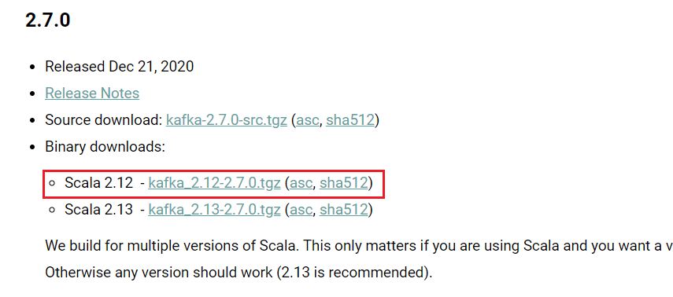
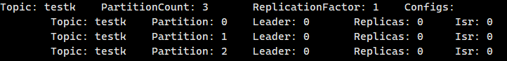
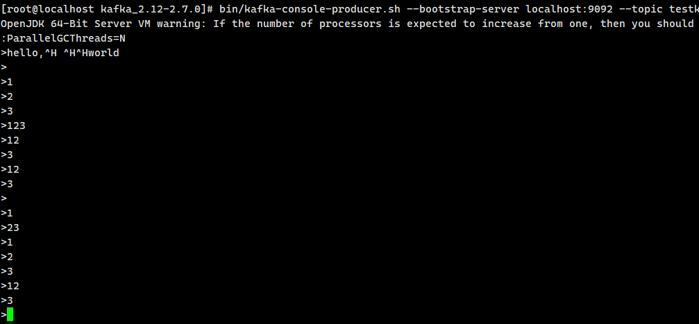
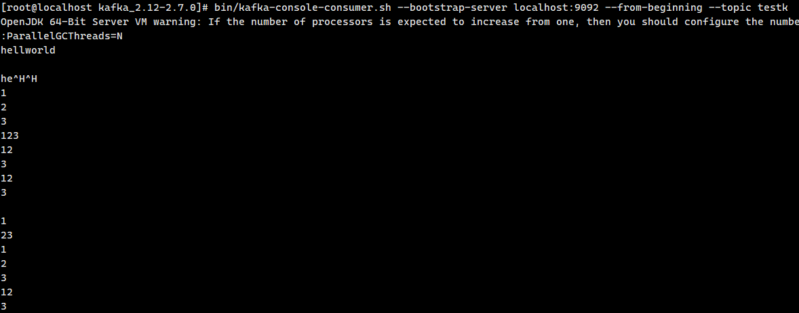

## 单机部署记录


#### 1.  下载kafka

[Apache Kafka](https://kafka.apache.org/downloads)

打开官网找到和老师版本一致  2.12-2.7.0



#### 2.  解压，改配置

windows环境，启动Centos7虚拟机，压缩包放在 `/etc/soft`下

```shell
[root@localhost kafka_2.12-2.7.0]# pwd
/etc/soft/kafka_2.12-2.7.0
```


```shell
vim config/server.properties

# 打开下面一项监听的配置，用内置的zookeeper  保存退出
listeners=PLAINTEXT://localhost:9092 
```

#### 3. 启动

##### 1.  先启动zookeeper

```shell
# 后挂启动
[root@localhost kafka_2.12-2.7.0]# nohup bin/zookeeper-server-start.sh config/zookeeper.properties &
[1] 46424
[root@localhost kafka_2.12-2.7.0]# nohup: ignoring input and appending output to ‘nohup.out’
```

##### 2.  再启动kafka

```shell
[root@localhost kafka_2.12-2.7.0]# bin/kafka-server-start.sh config/server.properties
```


#### 4.测试

##### 1.  查看有多少Topic队列

```shell
# 刚启动没有实例
[root@localhost kafka_2.12-2.7.0]# bin/kafka-topics.sh --zookeeper localhost:2181 --list
```

##### 2. 创建一个Topic队列   

名字为testk，分片partitions：3  副本因子replication-factor：1

```shell
[root@localhost kafka_2.12-2.7.0]# bin/kafka-topics.sh --zookeeper localhost:2181 --create --topic testk --partitions 3 --replication-factor 1
Created topic testk.
```

##### 3.查看某个Topic状态

```shell
[root@localhost kafka_2.12-2.7.0]# bin/kafka-topics.sh --zookeeper localhost:2181 --describe --topic testk
```



##### 4.创建消费者

```shell
# 创建完成以后，额外开启一个ssh
bin/kafka-console-consumer.sh --bootstrap-server localhost:9092 --from-beginning --topic testk
```

##### 5.创建生产者

```shell
bin/kafka-console-producer.sh --bootstrap-server localhost:9092 --topic testk
>
```

在`>`后输入消息

生产者端：



消费者端：



##### 6.性能测试

生产者性能

```shell
bin/kafka-producer-perf-test.sh --topic testk --num-records 100000 --record-size 1000 --
throughput 2000 --producer-props bootstrap.servers=localhost:9092
```

消费者性能

```shell
bin/kafka-consumer-perf-test.sh --bootstrap-server localhost:9092 --topic testk --fetch-size 
1048576 --messages 100000 --threads 1
```

单机100k以上


[java单机实验](kafka-demo)