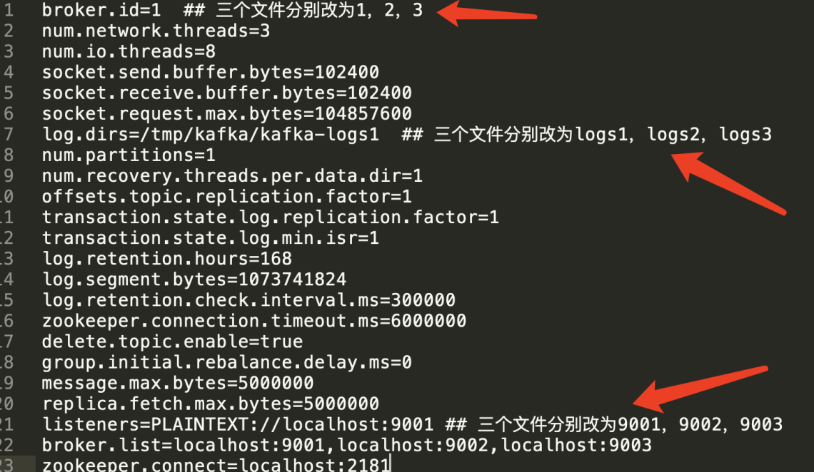

## kafka集群部署记录

#### 1.环境准备

准备3个配置文件  要求如下



[kafka9001.properties](kafka9001.properties)

[kafka9002.properties](kafka9002.properties)

[kafka9003.properties](kafka9003.properties)

手动创建日志目录

```shell
mkdir /tmp/kafka/kafka-logs1
mkdir /tmp/kafka/kafka-logs2
mkdir /tmp/kafka/kafka-logs3
```


清理zk上所有数据，也可以使用单机部署的zk


#### 2.启动

先启动zookeeper

然后分别使用三个命令行启动以下

```shell
./bin/kafka-server-start.sh kafka9001.properties 
./bin/kafka-server-start.sh kafka9002.properties 
./bin/kafka-server-start.sh kafka9003.properties 
```


#### 3.测试

```shell
# 创建带有副本的 topic：
bin/kafka-topics.sh --zookeeper localhost:2181 --create --topic test32 --partitions 3 --
replication-factor 2
bin/kafka-console-producer.sh --bootstrap-server localhost:9003 --topic test32
bin/kafka-console-consumer.sh --bootstrap-server localhost:9001 --topic test32 --frombeginning

# 执行性能测试：
bin/kafka-producer-perf-test.sh --topic test32 --num-records 100000 --record-size 1000 
--throughput 2000 --producer-props bootstrap.servers=localhost:9002
bin/kafka-consumer-perf-test.sh --bootstrap-server localhost:9002 --topic test32 --
fetch-size 1048576 --messages 100000 --threads 1

```


## 集群与多副本的说明 

1、ISR：In-Sync Replica 

2、Rebalance：broker 和 consumer group 的 rebalance 

3、热点分区：需要重新平衡